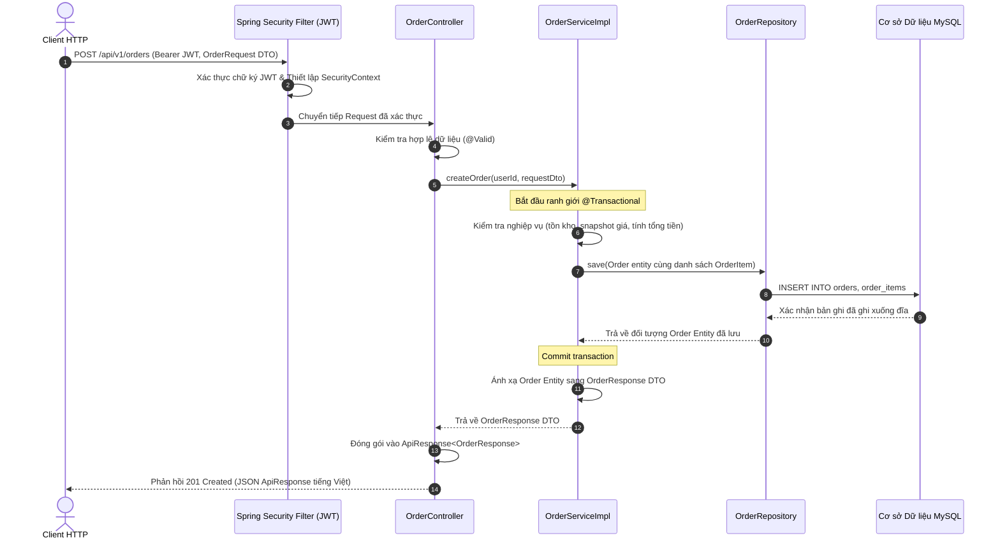
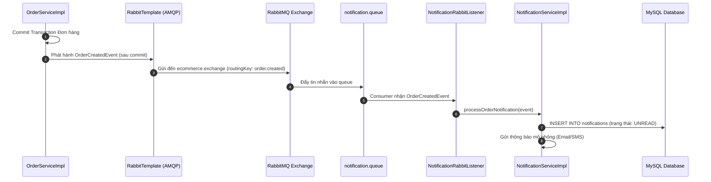

# Tài liệu Kiến trúc Hệ thống (Architecture Documentation)

> **Ứng dụng**: Hệ thống Backend Thương mại Điện tử (E-Commerce Backend System)  
> **Phong cách Kiến trúc**: Modular Monolith (Monolith Hướng Module)  
> **Nền tảng**: Java 21 | Spring Boot | Spring Data JPA | MySQL 8 | Redis | RabbitMQ  
> **Package Gốc**: `com.ecommerce`

---

## 1. Triết lý Kiến trúc: Modular Monolith (Monolith Hướng Module)

Hệ thống được thiết kế theo mô hình **Modular Monolith**. Ứng dụng được đóng gói và triển khai dưới dạng **một file thực thi Spring Boot duy nhất** (JAR / Docker container), kết nối với **một cơ sở dữ liệu quan hệ MySQL 8 duy nhất**, nhưng bên trong mã nguồn được phân chia ranh giới vật lý và logic nghiêm ngặt theo từng module nghiệp vụ (Feature-based).

```
┌────────────────────────────────────────────────────────────────────────┐
│                        Ứng dụng Spring Boot E-Commerce                 │
│                                                                        │
│   ┌──────────────┐   ┌──────────────┐   ┌──────────────┐               │
│   │ Module auth  │   │ Module user  │   │Module product│               │
│   └──────┬───────┘   └──────┬───────┘   └──────┬───────┘               │
│          │                  │                  │                       │
│          ▼                  ▼                  ▼                       │
│   ┌──────────────┐   ┌──────────────┐   ┌──────────────┐               │
│   │ Module order │   │notification  │   │shipping mod. │               │
│   └──────┬───────┘   └──────▲───────┘   └──────▲───────┘               │
│          │                  │                  │                       │
│          └───────────┬──────┴──────────────────┘                       │
│                      │ In-Process Service / RabbitMQ Event             │
│                      ▼                                                 │
│             Module common (Bảo mật, Ngoại lệ, DTO Dùng chung, Tiện ích)│
└───────────────────────┬─────────────────────────┬──────────────────────┘
                        │                         │
                        ▼                         ▼
            ┌──────────────────────┐    ┌──────────────────────┐
            │       MySQL 8        │    │     Redis Cache      │
            │  (Cơ sở Dữ liệu Chung│    │  (Bộ nhớ Đệm Tạm)    │
            └──────────────────────┘    └──────────────────────┘
```

### Tại sao Chọn Modular Monolith thay vì Microservices?

1. **Không bị Hao tổn Tài nguyên Hệ thống Phân tán (Zero Distributed Overhead)**:  
   Loại bỏ hoàn toàn độ trễ tuần tự hóa mạng (network latency), không cần điều phối giao dịch hai pha phức tạp (Two-Phase Commit), không cần service mesh cồng kềnh hay giải pháp distributed tracing đắt đỏ.
2. **Đảm bảo Tuyệt đối Tính toàn vẹn Giao dịch (ACID Transactions)**:  
   Cho phép thực hiện các thao tác then chốt (như đặt hàng, trừ tồn kho sản phẩm, ghi nhận lịch sử) một cách nguyên tử trong cùng một database transaction.
3. **Đơn giản hóa Vận hành & Triển khai**:  
   Chỉ cần một container duy nhất để triển khai, giám sát và scale ngang phía sau Reverse Proxy / Load Balancer.
4. **Phân định Domain Rõ ràng (Clear Domain Boundaries)**:  
   Mỗi module quản lý một phạm vi nghiệp vụ riêng biệt. Nếu trong tương lai quy mô phát triển yêu cầu tách dịch vụ, việc trích xuất module thành microservice độc lập có thể thực hiện dễ dàng mà không làm xáo trộn kiến trúc tổng thể.

---

## 2. Nguyên tắc Tổ chức Package: Feature-based Module

Hệ thống **tuyệt đối không** tổ chức theo kiểu truyền thống (Package-by-layer) nơi mà một package global gom toàn bộ `controllers`, `services`, `repositories`, `entities` của cả hệ thống lại với nhau. Cách làm đó phá vỡ tính đóng gói và gây phụ thuộc lẫn nhau không thể kiểm soát.

Thay vào đó, hệ thống áp dụng nguyên tắc **Feature-based Packaging**:
- **Mỗi module sở hữu toàn bộ domain của riêng mình**.
- Trong mỗi module, các thành phần được phân tầng rõ ràng:
  ```
  module
  ├── controller     # Tiếp nhận HTTP request của module
  ├── dto            # Request và Response payload
  ├── service        # Logic nghiệp vụ & Transaction boundary
  ├── repository     # Truy vấn dữ liệu của module
  └── entity         # Thực thể dữ liệu JPA thuộc quyền sở hữu của module
  ```
- **Tuyệt đối không tạo package global chứa toàn bộ entity/service/controller.**

---

## 3. Trách nhiệm Chi tiết của Từng Tầng (Layer Responsibilities)

Hệ thống thực thi nghiêm ngặt mô hình 4 tầng trách nhiệm:

```
┌────────────────────────────────────────────────────────┐
│ 1. Tầng Controller (Trình bày & Giao thức HTTP)        │
│    - Định tuyến Endpoint & HTTP Method                 │
│    - Kiểm tra hợp lệ dữ liệu đầu vào (@Valid)          │
│    - Đóng gói dữ liệu trả về trong ApiResponse<T>      │
└───────────────────────────┬────────────────────────────┘
                            │ Gọi Service truyền DTO / Command
                            ▼
┌────────────────────────────────────────────────────────┐
│ 2. Tầng Service (Nghiệp vụ Domain & Giao dịch)         │
│    - Thực thi quy tắc nghiệp vụ & công thức tính toán  │
│    - Quản lý ranh giới giao dịch (@Transactional)      │
│    - Điều phối các Repository và phát hành sự kiện     │
│    - Ánh xạ hai chiều giữa Entity và DTO               │
└───────────────────────────┬────────────────────────────┘
                            │ Truy vấn / Lưu Entity
                            ▼
┌────────────────────────────────────────────────────────┐
│ 3. Tầng Repository (Truy cập Dữ liệu & Lưu trữ)        │
│    - Interface Spring Data JPA                         │
│    - Truy vấn JPQL tối ưu (JOIN FETCH, @EntityGraph)   │
│    - JPA Specification cho tìm kiếm lọc động           │
└───────────────────────────┬────────────────────────────┘
                            │ Thực thi SQL qua JDBC
                            ▼
┌────────────────────────────────────────────────────────┐
│ 4. Tầng Database (Cơ sở Dữ liệu Quan hệ)               │
│    - MySQL 8.0 sử dụng InnoDB Engine                   │
│    - Ràng buộc Khóa chính, Khóa ngoại & Check          │
│    - B-Tree & Composite Index tối ưu truy vấn          │
└────────────────────────────────────────────────────────┘
```

### Bảng Phân định Trách nhiệm Từng Tầng

| Tầng | Hành vi Được Phép | Hành vi Bị Nghiêm Cấm |
|---|---|---|
| **Tầng Controller** | • Định nghĩa endpoint HTTP (`@GetMapping`, `@PostMapping`,...)<br>• Xác thực tính hợp lệ dữ liệu bằng `@Valid`<br>• Trích xuất thông tin người dùng từ `SecurityContextHolder`<br>• Ủy quyền xử lý ngay cho tầng Service<br>• Trả về `ResponseEntity<ApiResponse<T>>` | • Viết logic tính toán nghiệp vụ hay công thức<br>• Gọi trực tiếp hoặc `@Autowired` Repository<br>• Mở transaction `@Transactional`<br>• Tiếp nhận hoặc trả về trực tiếp JPA Entity |
| **Tầng Service** | • Thực thi các quy tắc nghiệp vụ, tính toán tiền, trừ tồn kho<br>• Quản lý ranh giới giao dịch `@Transactional`<br>• Gọi các Service công khai khác hoặc phát hành Domain Event<br>• Chuyển đổi dữ liệu giữa Entity và DTO | • Đọc trực tiếp HTTP Request, HttpServletRequest, Header<br>• Ném các ngoại lệ mang tính giao thức HTTP<br>• Để lộ tham chiếu JPA Entity ra tầng ngoài |
| **Tầng Repository** | • Kế thừa `JpaRepository` và `JpaSpecificationExecutor`<br>• Khai báo các câu lệnh JPQL có liên kết `JOIN FETCH`<br>• Thực hiện phân trang và sắp xếp dữ liệu ở mức database | • Chứa logic xử lý nghiệp vụ hay tính toán domain<br>• Gửi tin nhắn ra hàng đợi hoặc gọi service bên ngoài |
| **Tầng Database** | • Bảo đảm toàn vẹn dữ liệu quan hệ qua Foreign Key<br>• Tối ưu tốc độ tìm kiếm qua Index<br>• Thực thi giao dịch an toàn với tính chất ACID | • Chạy các Trigger hoặc Stored Procedure không được quản lý |

---

## 4. Cấu trúc Package Dự án (Package Structure)

Mã nguồn được tổ chức hoàn chỉnh dưới package `com.ecommerce`:

```
com.ecommerce
├── Application.java               # Điểm khởi chạy Spring Boot (@EnableJpaAuditing)
│
├── common                         # Module nền tảng dùng chung
│   ├── config                     # Cấu hình Web, JPA, Redis, RabbitMQ
│   ├── entity                     # BaseEntity (@MappedSuperclass với auditing)
│   ├── exception                  # GlobalExceptionHandler, Exception nghiệp vụ, ErrorCode
│   ├── response                   # ApiResponse, PagedResponse, ApiErrorResponse
│   ├── security                   # Security Filter Chain, JWT filter, Handler từ chối truy cập
│   └── util                       # Tiện ích ngày giờ, trích xuất thông tin bảo mật
│
├── auth                           # Module Xác thực & Phân quyền
│   ├── controller                 # AuthController (register, login, refresh, logout)
│   ├── dto                        # LoginRequest, RegisterRequest, TokenResponse, RefreshRequest
│   ├── entity                     # RefreshToken
│   ├── repository                 # RefreshTokenRepository
│   └── service                    # AuthService, RefreshTokenService, JwtService
│
├── user                           # Module Quản lý Người dùng & Vai trò
│   ├── controller                 # UserController, AdminUserController
│   ├── dto                        # UserResponse, UpdateProfileRequest, RoleDto
│   ├── entity                     # User, Role
│   ├── repository                 # UserRepository, RoleRepository
│   └── service                    # UserService, RoleService
│
├── product                        # Module Danh mục Sản phẩm & Tìm kiếm
│   ├── controller                 # ProductController, CategoryController
│   ├── dto                        # ProductRequest, ProductResponse, CategoryDto, FilterCriteria
│   ├── entity                     # Product, Category, ProductImage, Tag, ProductStatus
│   ├── repository                 # ProductRepository, CategoryRepository, TagRepository
│   ├── service                    # ProductService, CategoryService, ProductCacheService
│   └── specification              # ProductSpecification (Xây dựng Predicate lọc động)
│
├── order                          # Module Đơn hàng & Thanh toán
│   ├── controller                 # OrderController, AdminOrderController
│   ├── dto                        # CreateOrderRequest, OrderResponse, OrderItemDto
│   ├── entity                     # Order, OrderItem, OrderStatus, PaymentStatus
│   ├── repository                 # OrderRepository, OrderItemRepository
│   └── service                    # OrderService, OrderCalculationService, OrderStateMachine
│
├── notification                   # Module Thông báo Bất đồng bộ
│   ├── consumer                   # NotificationRabbitListener (Lắng nghe AMQP queue)
│   ├── dto                        # NotificationResponse
│   ├── entity                     # Notification
│   ├── producer                   # NotificationMessageProducer
│   └── service                    # NotificationService, EmailSenderService (mô phỏng)
│
└── shipping                       # Module Giao vận & Tích hợp Đơn vị Vận chuyển
    ├── client                     # ExternalShippingCarrierClient (HTTP Client / Mock)
    ├── dto                        # ShipmentResponse, CarrierWebhookPayload
    ├── entity                     # Shipment
    └── service                    # ShippingService, ShippingSyncScheduler
```

---

## 5. Luồng Xử lý Request trong Hệ thống (Request Flow)

### 5.1 Luồng Xử lý Đồng bộ: Controller → Service → Repository → Database

Sơ đồ trình bày chi tiết hành trình của một request (ví dụ: Tạo đơn hàng `POST /api/v1/orders`):



### 5.2 Luồng Xử lý Bất đồng bộ: Sự kiện Domain & Hàng đợi RabbitMQ

Khi có các tác vụ phụ phát sinh sau khi lưu trữ thành công (như gửi email, push notification, tạo vận đơn):



---

## 6. Ranh giới Giữa các Module (Module Boundaries)

Để đảm bảo hệ thống Modular Monolith không bị thoái hóa thành "Big Ball of Mud" (mớ bòng bong liên kết chặt chẽ), mọi lập trình viên và AI agent bắt buộc phải tuân theo các nguyên tắc ranh giới:

1. **Quyền Truy cập Repository là Hoàn toàn Riêng tư**:
   - Chỉ `ProductService` mới được phép truy cập `ProductRepository`.
   - Khi `OrderService` cần kiểm tra tồn kho hoặc giá sản phẩm, nó **bắt buộc phải gọi qua `ProductService`**, tuyệt đối không được inject `ProductRepository`.
2. **Cách ly Thực thể Khỏi API Công khai**:
   - Các phương thức Service công khai dùng để giao tiếp liên module chỉ được nhận và trả về DTO hoặc Java record bất biến, không truyền Entity JPA.
3. **Phân tách Tác vụ Phụ bằng Sự kiện**:
   - Việc tạo đơn hàng không được gọi trực tiếp `NotificationService` hoặc `ShippingService` một cách đồng bộ trong cùng transaction của đơn hàng.
   - Luôn sử dụng RabbitMQ event hoặc Spring `@TransactionalEventListener(phase = TransactionPhase.AFTER_COMMIT)`.
4. **Không Tạo Phụ thuộc Vòng (No Cyclic Dependencies)**:
   - Sơ đồ phụ thuộc giữa các module phải là Đồ thị Có hướng Không chu trình (DAG).
   - Module `order` có thể phụ thuộc vào `product` và `user`.
   - Module `product` **tuyệt đối không** được phụ thuộc ngược lại vào `order`.
   - Tất cả các module đều phụ thuộc vào `common`. Module `common` không phụ thuộc vào bất kỳ module nào khác.
