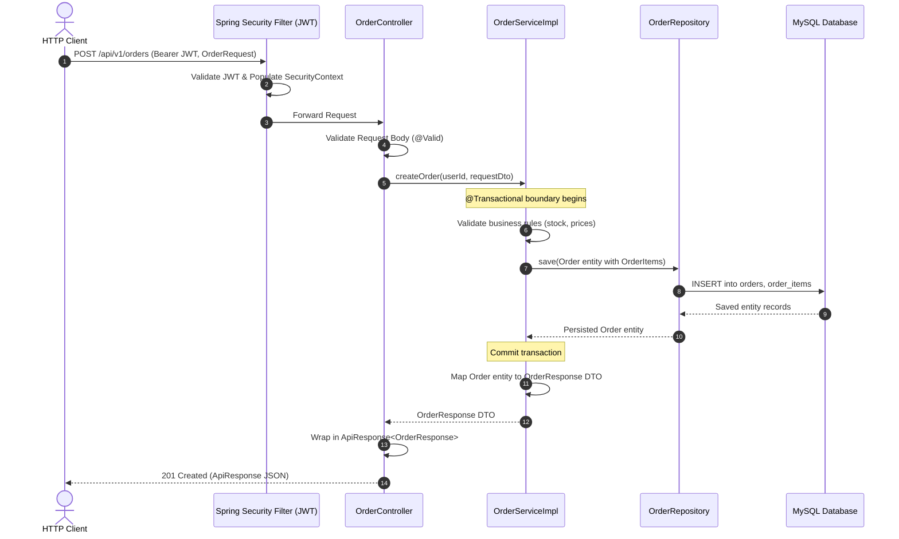
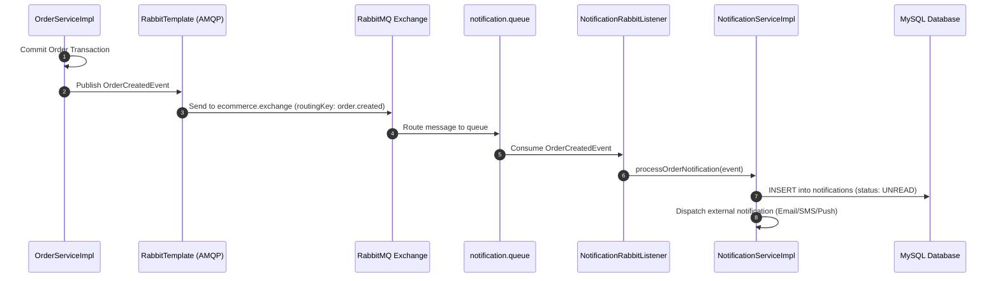

# Architecture Documentation - E-Commerce Backend System

> **Application**: E-Commerce Backend  
> **Architecture Pattern**: Modular Monolith  
> **Platform**: Java 21 | Spring Boot | Spring Data JPA | MySQL 8 | Redis | RabbitMQ  
> **Root Package**: `com.ecommerce`

---

## 1. Architectural Philosophy: The Modular Monolith

The backend is built as a **Modular Monolith**. It consists of a single deployable artifact (JAR/container) with one shared relational database (MySQL 8), while enforcing strict physical and logical boundaries between domain modules.

```
┌────────────────────────────────────────────────────────────────────────┐
│                        E-Commerce Spring Boot Application              │
│                                                                        │
│   ┌──────────────┐   ┌──────────────┐   ┌──────────────┐               │
│   │  auth module │   │  user module │   │product module│               │
│   └──────┬───────┘   └──────┬───────┘   └──────┬───────┘               │
│          │                  │                  │                       │
│          ▼                  ▼                  ▼                       │
│   ┌──────────────┐   ┌──────────────┐   ┌──────────────┐               │
│   │ order module │   │notification  │   │shipping mod. │               │
│   └──────┬───────┘   └──────▲───────┘   └──────▲───────┘               │
│          │                  │                  │                       │
│          └───────────┬──────┴──────────────────┘                       │
│                      │ In-Process Events & RabbitMQ                    │
│                      ▼                                                 │
│               common module (Security, Exceptions, DTOs, Utils)        │
└───────────────────────┬─────────────────────────┬──────────────────────┘
                        │                         │
                        ▼                         ▼
            ┌──────────────────────┐    ┌──────────────────────┐
            │       MySQL 8        │    │     Redis Cache      │
            │  (Single Database)   │    │  (In-Memory Store)   │
            └──────────────────────┘    └──────────────────────┘
```

### Why Modular Monolith (and NOT Microservices)?
1. **Zero Distributed Systems Overhead**: Avoids network serialization latency, two-phase commits, distributed tracing overhead, and complex service mesh configurations.
2. **ACID Transactions**: Enables atomic transactional updates across critical business flows (e.g., placing an order and decrementing inventory) within a single database transaction.
3. **Simplicity in Deployment & Operations**: One Docker container to deploy, monitor, and scale horizontally behind a standard reverse proxy or load balancer.
4. **Strong Domain Boundaries**: Clear module separation allows future extraction into independent microservices if organizational scale demands it, without requiring premature distribution now.

---

## 2. Layer Responsibilities

The system strictly enforces a layered architecture within each module:

```
┌────────────────────────────────────────────────────────┐
│ 1. Controller Layer (Presentation & HTTP)              │
│    - Endpoint Routing & HTTP Methods                   │
│    - Request Validation (@Valid, @NotNull, etc.)        │
│    - Wrapping responses into ApiResponse<T>            │
└───────────────────────────┬────────────────────────────┘
                            │ Calls Service DTO / Command
                            ▼
┌────────────────────────────────────────────────────────┐
│ 2. Service Layer (Business Logic & Transactions)       │
│    - Pure domain business rules & calculations         │
│    - Transactional boundaries (@Transactional)         │
│    - Coordination between repositories                 │
│    - Event publishing (Spring ApplicationEvent / AMQP) │
│    - Mapping Entities <-> DTOs                         │
└───────────────────────────┬────────────────────────────┘
                            │ Queries / Saves Entities
                            ▼
┌────────────────────────────────────────────────────────┐
│ 3. Repository Layer (Data Access & Persistence)        │
│    - Spring Data JPA Interfaces                        │
│    - JPQL queries with JOIN FETCH                      │
│    - JPA Specifications for dynamic filtering          │
└───────────────────────────┬────────────────────────────┘
                            │ Executes SQL via JDBC
                            ▼
┌────────────────────────────────────────────────────────┐
│ 4. Database Layer (Relational Storage)                 │
│    - MySQL 8 with InnoDB Engine                        │
│    - Primary & Foreign Key Constraints                 │
│    - Indexes & Constraints                             │
└────────────────────────────────────────────────────────┘
```

### Detailed Layer Duties

| Layer | Permitted Actions | Strictly Prohibited Actions |
|---|---|---|
| **Controller Layer** | • Define HTTP endpoints (`@GetMapping`, `@PostMapping`, etc.)<br>• Validate incoming request payloads via `@Valid`<br>• Extract route/query parameters and authentication context<br>• Delegate execution immediately to Service layer<br>• Return `ResponseEntity<ApiResponse<T>>` | • Executing business rules or math calculations<br>• Directly querying or injecting JPA Repositories<br>• Handling database transactions (`@Transactional`)<br>• Accepting or returning raw JPA Entities |
| **Service Layer** | • Enforce domain rules, invariants, and constraints<br>• Manage transaction boundaries (`@Transactional`)<br>• Coordinate multiple repositories or call other module services<br>• Publish domain events to Spring or RabbitMQ<br>• Convert Entities to DTOs and vice-versa | • Directly reading HTTP requests, headers, or servlets<br>• Emitting HTTP-specific exceptions (return domain exceptions instead)<br>• Leaking JPA entity references to the presentation layer |
| **Repository Layer**| • Extending `JpaRepository<T, ID>` and `JpaSpecificationExecutor<T>`<br>• Defining derived queries and JPQL queries with explicit joins<br>• Performing database pagination and sorting | • Containing business logic or data transformations<br>• Directly communicating with external services or message queues |
| **Database Layer**  | • Enforcing relational integrity via foreign keys and check constraints<br>• Fast indexing for frequent query filters<br>• Executing ACID transactions | • Triggering external procedures or unmanaged stored procedures |

---

## 3. Package Structure

The project code is organized by **feature module** rather than by technical layer, keeping related components highly cohesive:

```
com.ecommerce
├── Application.java
│
├── common                         # Cross-cutting foundational module
│   ├── config                     # Web, Security, Redis, RabbitMQ config
│   ├── exception                  # GlobalExceptionHandler, CustomExceptions, ErrorCodes
│   ├── response                   # ApiResponse, PagedResponse, ErrorResponse
│   ├── entity                     # BaseAuditableEntity, SoftDeletable
│   └── util                       # DateTime, SecurityUtils, PaginationUtils
│
├── auth                           # Authentication & Authorization module
│   ├── controller                 # AuthController
│   ├── dto                        # LoginRequest, RegisterRequest, TokenResponse
│   ├── entity                     # RefreshToken
│   ├── repository                 # RefreshTokenRepository
│   ├── security                   # JwtTokenProvider, JwtAuthenticationFilter, UserDetailsServiceImpl
│   └── service                    # AuthService, RefreshTokenService
│
├── user                           # User & Role Management module
│   ├── controller                 # UserController, AdminUserController
│   ├── dto                        # UserResponse, UpdateProfileRequest, RoleDto
│   ├── entity                     # User, Role
│   ├── repository                 # UserRepository, RoleRepository
│   └── service                    # UserService, RoleService
│
├── product                        # Product Catalog & Search module
│   ├── controller                 # ProductController, CategoryController
│   ├── dto                        # ProductRequest, ProductResponse, CategoryDto, ProductFilterCriteria
│   ├── entity                     # Product, Category, ProductImage, Tag, ProductTag
│   ├── repository                 # ProductRepository, CategoryRepository, TagRepository
│   ├── specification              # ProductSpecification (Dynamic JPQL filters)
│   └── service                    # ProductService, CategoryService, ProductCacheService
│
├── order                          # Order & Checkout module
│   ├── controller                 # OrderController, AdminOrderController
│   ├── dto                        # CreateOrderRequest, OrderResponse, OrderItemDto, OrderStatusUpdateRequest
│   ├── entity                     # Order, OrderItem
│   ├── event                      # OrderCreatedEvent, OrderStatusChangedEvent
│   ├── repository                 # OrderRepository, OrderItemRepository
│   └── service                    # OrderService, OrderCalculationService, OrderStateMachine
│
├── notification                   # Asynchronous Notifications module
│   ├── consumer                   # NotificationRabbitListener (AMQP listener)
│   ├── controller                 # NotificationController
│   ├── dto                        # NotificationResponse
│   ├── entity                     # Notification
│   ├── repository                 # NotificationRepository
│   └── service                    # NotificationService, EmailSenderService (mock)
│
└── shipping                       # External Logistics & Delivery module
    ├── client                     # ExternalShippingCarrierClient (HTTP/Mock)
    ├── controller                 # ShipmentController, ShippingWebhookController
    ├── dto                        # ShipmentResponse, CarrierWebhookPayload
    ├── entity                     # Shipment
    ├── repository                 # ShipmentRepository
    └── service                    # ShippingService, ShippingSyncScheduler
```

---

## 4. Request & Execution Flow

### 4.1 Synchronous Flow: Controller → Service → Repository → Database

The following diagram illustrates how a typical incoming request (e.g., creating an order or fetching product details) traverses the application layers:



### 4.2 Asynchronous Flow: Domain Events & Queue Processing

When side effects are non-essential to the immediate HTTP response (such as sending user notifications or generating external logistics tracking codes), the Service layer publishes domain events to RabbitMQ:



---

## 5. In-Process Module Boundaries & Cross-Module Rules

To prevent the Modular Monolith from degenerating into a tightly coupled "big ball of mud", all developers and AI agents must abide by the following boundaries:

1. **Repository Access Is Strictly Private**:
   - Only `ProductService` may access `ProductRepository`.
   - If `OrderService` needs to verify product pricing and stock, it **must invoke `ProductService`**, never `ProductRepository` directly.
2. **Entity Isolation in Public APIs**:
   - Public service methods that are accessible to other modules must accept and return immutable DTOs or domain records, not internal JPA Entities.
3. **Decoupled Side Effects**:
   - Order creation must not directly invoke `NotificationService` or `ShippingService` synchronously inside the order transaction.
   - Use asynchronous RabbitMQ events or Spring `@TransactionalEventListener(phase = TransactionPhase.AFTER_COMMIT)` to decouple secondary side effects.
4. **No Cyclic Dependencies**:
   - Dependencies between modules must form a Directed Acyclic Graph (DAG).
   - `order` may depend on `product` and `user`.
   - `product` **must never** depend on `order`.
   - All modules depend on `common`. `common` depends on no module.
