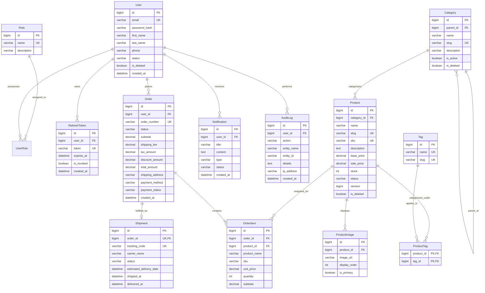

# Database Architecture & Schema Specification

> **Engine**: MySQL 8.0 (InnoDB)  
> **Character Set**: `utf8mb4` | **Collation**: `utf8mb4_unicode_ci`  
> **Migration Tool**: Flyway  
> **Application Context**: E-Commerce Backend System (Modular Monolith)

---

## 1. Overview & Design Principles

The database follows strict relational normalization principles (3NF), ensuring ACID guarantees, data integrity, and performant index lookups. All schema definition and structural changes are governed solely via **Flyway migrations**. Direct manual DDL changes or Hibernate auto-generation (`ddl-auto: update/create`) are strictly prohibited.

---

## 2. Entity-Relationship Diagram (ERD)

---

## 3. Table Responsibilities & Detailed Schema

### 3.1 `roles`
Stores access roles for Role-Based Access Control (RBAC).
- `id` (BIGINT, PK, AUTO_INCREMENT): Unique role identifier.
- `name` (VARCHAR(50), NOT NULL, UNIQUE): Unique role authority name (e.g., `ROLE_CUSTOMER`, `ROLE_ADMIN`, `ROLE_STAFF`).
- `description` (VARCHAR(255), NULL): Explanation of role responsibilities.
- `created_at` (DATETIME, NOT NULL, DEFAULT CURRENT_TIMESTAMP).

### 3.2 `users`
Core customer and administrative identity table.
- `id` (BIGINT, PK, AUTO_INCREMENT): Unique user identifier.
- `email` (VARCHAR(150), NOT NULL, UNIQUE): User login email.
- `password_hash` (VARCHAR(255), NOT NULL): BCrypt hashed password (never plaintext).
- `first_name` (VARCHAR(100), NOT NULL): First name.
- `last_name` (VARCHAR(100), NOT NULL): Last name.
- `phone` (VARCHAR(20), NULL): Contact phone number.
- `status` (VARCHAR(30), NOT NULL, DEFAULT 'ACTIVE'): Status (`ACTIVE`, `SUSPENDED`, `LOCKED`).
- `is_deleted` (BOOLEAN, NOT NULL, DEFAULT FALSE): Soft-delete flag.
- `deleted_at` (DATETIME, NULL): Timestamp when marked deleted.
- `created_at` (DATETIME, NOT NULL, DEFAULT CURRENT_TIMESTAMP).
- `updated_at` (DATETIME, NOT NULL, DEFAULT CURRENT_TIMESTAMP ON UPDATE CURRENT_TIMESTAMP).

### 3.3 `user_roles`
Join table establishing Many-to-Many mapping between users and roles.
- `user_id` (BIGINT, NOT NULL, FK -> `users.id` ON DELETE CASCADE).
- `role_id` (BIGINT, NOT NULL, FK -> `roles.id` ON DELETE RESTRICT).
- **PRIMARY KEY** (`user_id`, `role_id`).

### 3.4 `refresh_tokens`
Tracks active long-lived JWT refresh tokens for secure session rotation.
- `id` (BIGINT, PK, AUTO_INCREMENT): Identifier.
- `user_id` (BIGINT, NOT NULL, FK -> `users.id` ON DELETE CASCADE): Token owner.
- `token` (VARCHAR(255), NOT NULL, UNIQUE): Cryptographically secure random UUID token string.
- `expires_at` (DATETIME, NOT NULL): Expiration boundary (e.g. 7 days).
- `is_revoked` (BOOLEAN, NOT NULL, DEFAULT FALSE): Revocation status.
- `created_at` (DATETIME, NOT NULL, DEFAULT CURRENT_TIMESTAMP).

### 3.5 `categories`
Hierarchical product classification supporting infinite nested subcategories.
- `id` (BIGINT, PK, AUTO_INCREMENT): Category ID.
- `parent_id` (BIGINT, NULL, FK -> `categories.id` ON DELETE RESTRICT): Self-referencing parent node for subcategories.
- `name` (VARCHAR(100), NOT NULL): Category name.
- `slug` (VARCHAR(120), NOT NULL, UNIQUE): URL-friendly unique slug.
- `description` (VARCHAR(500), NULL): Detailed category overview.
- `is_active` (BOOLEAN, NOT NULL, DEFAULT TRUE): Display visibility flag.
- `is_deleted` (BOOLEAN, NOT NULL, DEFAULT FALSE): Soft-delete flag.
- `created_at` (DATETIME, NOT NULL, DEFAULT CURRENT_TIMESTAMP).
- `updated_at` (DATETIME, NOT NULL, DEFAULT CURRENT_TIMESTAMP ON UPDATE CURRENT_TIMESTAMP).

### 3.6 `products`
The core catalog item table with concurrency support and inventory tracking.
- `id` (BIGINT, PK, AUTO_INCREMENT): Product ID.
- `category_id` (BIGINT, NOT NULL, FK -> `categories.id` ON DELETE RESTRICT): Primary category.
- `name` (VARCHAR(200), NOT NULL): Product display name.
- `slug` (VARCHAR(220), NOT NULL, UNIQUE): Unique slug for SEO routing.
- `sku` (VARCHAR(100), NOT NULL, UNIQUE): Stock Keeping Unit identifier.
- `description` (TEXT, NULL): Full markdown/HTML product description.
- `base_price` (DECIMAL(12,2), NOT NULL): Base retail price (`base_price > 0`).
- `sale_price` (DECIMAL(12,2), NULL): Optional promotional price (`sale_price < base_price`).
- `stock` (INT, NOT NULL, DEFAULT 0): Available stock quantity (`stock >= 0`).
- `status` (VARCHAR(30), NOT NULL, DEFAULT 'DRAFT'): Product status (`DRAFT`, `ACTIVE`, `INACTIVE`, `ARCHIVED`).
- `version` (BIGINT, NOT NULL, DEFAULT 0): Optimistic locking version for concurrent updates.
- `is_deleted` (BOOLEAN, NOT NULL, DEFAULT FALSE): Soft-delete flag.
- `deleted_at` (DATETIME, NULL): Soft-delete timestamp.
- `created_at` (DATETIME, NOT NULL, DEFAULT CURRENT_TIMESTAMP).
- `updated_at` (DATETIME, NOT NULL, DEFAULT CURRENT_TIMESTAMP ON UPDATE CURRENT_TIMESTAMP).

### 3.7 `product_images`
Images associated with a product.
- `id` (BIGINT, PK, AUTO_INCREMENT): Image ID.
- `product_id` (BIGINT, NOT NULL, FK -> `products.id` ON DELETE CASCADE): Associated product.
- `image_url` (VARCHAR(500), NOT NULL): CDN/S3 URL for the image asset.
- `display_order` (INT, NOT NULL, DEFAULT 0): Visual sorting position.
- `is_primary` (BOOLEAN, NOT NULL, DEFAULT FALSE): Flag indicating main thumbnail image.
- `created_at` (DATETIME, NOT NULL, DEFAULT CURRENT_TIMESTAMP).

### 3.8 `tags`
Categorization labels for filtering (e.g., "Trending", "Summer", "Sale").
- `id` (BIGINT, PK, AUTO_INCREMENT): Tag ID.
- `name` (VARCHAR(50), NOT NULL, UNIQUE): Tag name.
- `slug` (VARCHAR(60), NOT NULL, UNIQUE): Tag slug.
- `created_at` (DATETIME, NOT NULL, DEFAULT CURRENT_TIMESTAMP).

### 3.9 `product_tags`
Join table establishing Many-to-Many mapping between products and tags.
- `product_id` (BIGINT, NOT NULL, FK -> `products.id` ON DELETE CASCADE).
- `tag_id` (BIGINT, NOT NULL, FK -> `tags.id` ON DELETE CASCADE).
- **PRIMARY KEY** (`product_id`, `tag_id`).

### 3.10 `orders`
The master order entity capturing transaction header details and lifecycle states.
- `id` (BIGINT, PK, AUTO_INCREMENT): Internal order ID.
- `user_id` (BIGINT, NOT NULL, FK -> `users.id` ON DELETE RESTRICT): Ordering user.
- `order_number` (VARCHAR(50), NOT NULL, UNIQUE): Human-readable public identifier (e.g. `ORD-20261002-12345`).
- `status` (VARCHAR(30), NOT NULL, DEFAULT 'PENDING'): Lifecycle status (`PENDING`, `CONFIRMED`, `PROCESSING`, `SHIPPED`, `DELIVERED`, `CANCELLED`, `REFUNDED`).
- `subtotal` (DECIMAL(12,2), NOT NULL): Sum of item snapshots.
- `shipping_fee` (DECIMAL(12,2), NOT NULL, DEFAULT 0.00): Shipping cost.
- `tax_amount` (DECIMAL(12,2), NOT NULL, DEFAULT 0.00): Tax amount.
- `discount_amount` (DECIMAL(12,2), NOT NULL, DEFAULT 0.00): Discount coupon reductions.
- `total_amount` (DECIMAL(12,2), NOT NULL): Final payable total (`subtotal + shipping_fee + tax_amount - discount_amount`).
- `shipping_address` (VARCHAR(500), NOT NULL): Delivery address snapshot.
- `payment_method` (VARCHAR(50), NOT NULL): Payment gateway / method (`COD`, `CREDIT_CARD`, `BANK_TRANSFER`).
- `payment_status` (VARCHAR(30), NOT NULL, DEFAULT 'PENDING'): Payment state (`PENDING`, `PAID`, `FAILED`, `REFUNDED`).
- `created_at` (DATETIME, NOT NULL, DEFAULT CURRENT_TIMESTAMP).
- `updated_at` (DATETIME, NOT NULL, DEFAULT CURRENT_TIMESTAMP ON UPDATE CURRENT_TIMESTAMP).

### 3.11 `order_items`
Immutable line-item snapshots preserved at checkout time.
- `id` (BIGINT, PK, AUTO_INCREMENT): Order item ID.
- `order_id` (BIGINT, NOT NULL, FK -> `orders.id` ON DELETE CASCADE): Parent order.
- `product_id` (BIGINT, NOT NULL, FK -> `products.id` ON DELETE RESTRICT): Original product reference.
- `product_name` (VARCHAR(200), NOT NULL): Frozen snapshot of product name.
- `sku` (VARCHAR(100), NOT NULL): Frozen snapshot of SKU.
- `unit_price` (DECIMAL(12,2), NOT NULL): Frozen snapshot of product price at purchase.
- `quantity` (INT, NOT NULL): Number of units purchased (`quantity > 0`).
- `subtotal` (DECIMAL(12,2), NOT NULL): Line total (`unit_price * quantity`).

### 3.12 `shipments`
Logistics fulfillment tracking mapped 1:1 to orders.
- `id` (BIGINT, PK, AUTO_INCREMENT): Shipment ID.
- `order_id` (BIGINT, NOT NULL, UNIQUE, FK -> `orders.id` ON DELETE RESTRICT): Fulfilled order.
- `tracking_code` (VARCHAR(100), NOT NULL, UNIQUE): Carrier-issued tracking number.
- `carrier_name` (VARCHAR(100), NOT NULL): Logistics carrier (e.g., ViettelPost, DHL, FedEx).
- `status` (VARCHAR(30), NOT NULL, DEFAULT 'LABEL_CREATED'): Logistics status (`LABEL_CREATED`, `PICKED_UP`, `IN_TRANSIT`, `OUT_FOR_DELIVERY`, `DELIVERED`, `RETURNED`).
- `estimated_delivery_date` (DATETIME, NULL): Estimated arrival date.
- `shipped_at` (DATETIME, NULL): Dispatch timestamp.
- `delivered_at` (DATETIME, NULL): Delivery timestamp.
- `created_at` (DATETIME, NOT NULL, DEFAULT CURRENT_TIMESTAMP).
- `updated_at` (DATETIME, NOT NULL, DEFAULT CURRENT_TIMESTAMP ON UPDATE CURRENT_TIMESTAMP).

### 3.13 `notifications`
User alert inbox and messaging log.
- `id` (BIGINT, PK, AUTO_INCREMENT): Notification ID.
- `user_id` (BIGINT, NOT NULL, FK -> `users.id` ON DELETE CASCADE): Recipient user.
- `title` (VARCHAR(200), NOT NULL): Alert headline.
- `content` (TEXT, NOT NULL): Full notification message body.
- `type` (VARCHAR(50), NOT NULL): Notification category (`ORDER_STATUS`, `PAYMENT`, `SYSTEM`, `PROMOTION`).
- `status` (VARCHAR(20), NOT NULL, DEFAULT 'UNREAD'): Read status (`UNREAD`, `READ`).
- `created_at` (DATETIME, NOT NULL, DEFAULT CURRENT_TIMESTAMP).

### 3.14 `audit_logs`
Immutable compliance and activity record.
- `id` (BIGINT, PK, AUTO_INCREMENT): Audit record ID.
- `user_id` (BIGINT, NULL, FK -> `users.id` ON DELETE SET NULL): User who initiated the action (NULL for system events).
- `action` (VARCHAR(100), NOT NULL): Action executed (e.g. `ORDER_CANCELLED`, `PRODUCT_UPDATED`).
- `entity_name` (VARCHAR(100), NOT NULL): Target entity class (e.g. `Order`, `Product`).
- `entity_id` (VARCHAR(100), NOT NULL): Primary key of target entity.
- `details` (TEXT, NULL): JSON payload of old vs new values or event metadata.
- `ip_address` (VARCHAR(45), NULL): Client IP address.
- `created_at` (DATETIME, NOT NULL, DEFAULT CURRENT_TIMESTAMP).

---

## 4. Key Constraints & Referential Integrity Rules

1. **Foreign Key Integrity**:
   - `ON DELETE RESTRICT` is enforced for structural business links (`categories -> products`, `users -> orders`, `products -> order_items`). This prevents catastrophic cascading data loss if an entity is deleted.
   - `ON DELETE CASCADE` is only permitted for tightly bound child aggregates that have no independent existence (`products -> product_images`, `orders -> order_items`, `users -> refresh_tokens`).
2. **Business Check Constraints**:
   - `products`: `CONSTRAINT chk_product_price CHECK (base_price > 0)`
   - `products`: `CONSTRAINT chk_product_sale_price CHECK (sale_price IS NULL OR sale_price < base_price)`
   - `products`: `CONSTRAINT chk_product_stock CHECK (stock >= 0)`
   - `order_items`: `CONSTRAINT chk_order_item_qty CHECK (quantity > 0)`
   - `orders`: `CONSTRAINT chk_order_total CHECK (total_amount >= 0)`
3. **Uniqueness Enforcements**:
   - `users.email`
   - `categories.slug`
   - `products.sku`, `products.slug`
   - `orders.order_number`
   - `shipments.tracking_code`, `shipments.order_id` (1:1 constraint)
   - `refresh_tokens.token`

---

## 5. Indexing Strategy

To maintain sub-50ms query response times at scale, database indexes are strategically placed:

| Table | Index Name | Columns | Type | Purpose |
|---|---|---|---|---|
| `users` | `idx_users_email` | `email` | UNIQUE | Login credential lookup |
| `users` | `idx_users_status_deleted` | `status`, `is_deleted` | B-TREE | Active user filtering |
| `products` | `idx_products_sku` | `sku` | UNIQUE | Inventory & barcode scanning |
| `products` | `idx_products_slug` | `slug` | UNIQUE | Direct storefront URL resolution |
| `products` | `idx_products_cat_status_del` | `category_id`, `status`, `is_deleted` | COMPOSITE | Category catalog browsing |
| `products` | `idx_products_price` | `base_price` | B-TREE | Price range filter (`minPrice`, `maxPrice`) |
| `products` | `idx_products_created` | `created_at` | B-TREE | "Newest arrivals" sorting |
| `orders` | `idx_orders_order_number` | `order_number` | UNIQUE | Customer order lookup |
| `orders` | `idx_orders_user_created` | `user_id`, `created_at` | COMPOSITE | User order history pagination |
| `orders` | `idx_orders_status_created` | `status`, `created_at` | COMPOSITE | Admin status filtering & fulfillment queue |
| `order_items` | `idx_order_items_order_id` | `order_id` | B-TREE | Order line item join retrieval |
| `order_items` | `idx_order_items_product_id` | `product_id` | B-TREE | Product order history analysis |
| `shipments` | `idx_shipments_order_id` | `order_id` | UNIQUE | 1:1 Order lookup |
| `shipments` | `idx_shipments_tracking` | `tracking_code` | UNIQUE | Webhook and tracking portal lookup |
| `notifications`| `idx_notifications_user_status` | `user_id`, `status` | COMPOSITE | Unread notification badges & list |
| `audit_logs` | `idx_audit_logs_entity` | `entity_name`, `entity_id` | COMPOSITE | Entity change history inspection |

---

## 6. Soft Deletion & Audit Strategy

### Soft Delete Rule
Entities containing financial, inventory, or user records (`users`, `categories`, `products`) must **never be deleted with `DELETE FROM table`**.
- When deleted via API, set `is_deleted = TRUE` and `deleted_at = CURRENT_TIMESTAMP`.
- In JPA Entities, implement soft delete using Hibernate annotations:
  - `@SQLDelete(sql = "UPDATE products SET is_deleted = true, deleted_at = CURRENT_TIMESTAMP WHERE id = ?")`
  - `@SQLRestriction("is_deleted = false")`
- Referential links remain preserved: historical orders can still reference deleted products without foreign key violations.

### Audit Columns
Every persistent business table extends `BaseAuditableEntity` providing:
- `created_at`: Set on entity insert, immutable.
- `updated_at`: Automatically updated on entity modification.

---

## 7. Migration Rules & Flyway Protocol

1. **File Location**:  
   All migration scripts are stored in `src/main/resources/db/migration/`.
2. **Naming Standard**:  
   `V<Version>__<Description_in_snake_case>.sql` (note double underscore `__`).
   - `V1__init_auth_and_user_schema.sql`
   - `V2__init_product_catalog_schema.sql`
   - `V3__init_order_and_audit_schema.sql`
   - `V4__init_notification_schema.sql`
   - `V5__init_shipment_schema.sql`
3. **Strict Rules**:
   - **Never alter a migration file that has been committed or run in any environment.** Flyway computes a SHA-256 checksum; any mismatch will abort startup.
   - Any bug fixes or schema changes must be added as a **new version** (e.g., `V6__add_avatar_url_to_users.sql`).
   - Every table creation script must explicitly specify `ENGINE=InnoDB DEFAULT CHARSET=utf8mb4 COLLATE=utf8mb4_unicode_ci`.
   - Seed data for testing should be kept separate from structural schema migrations.
