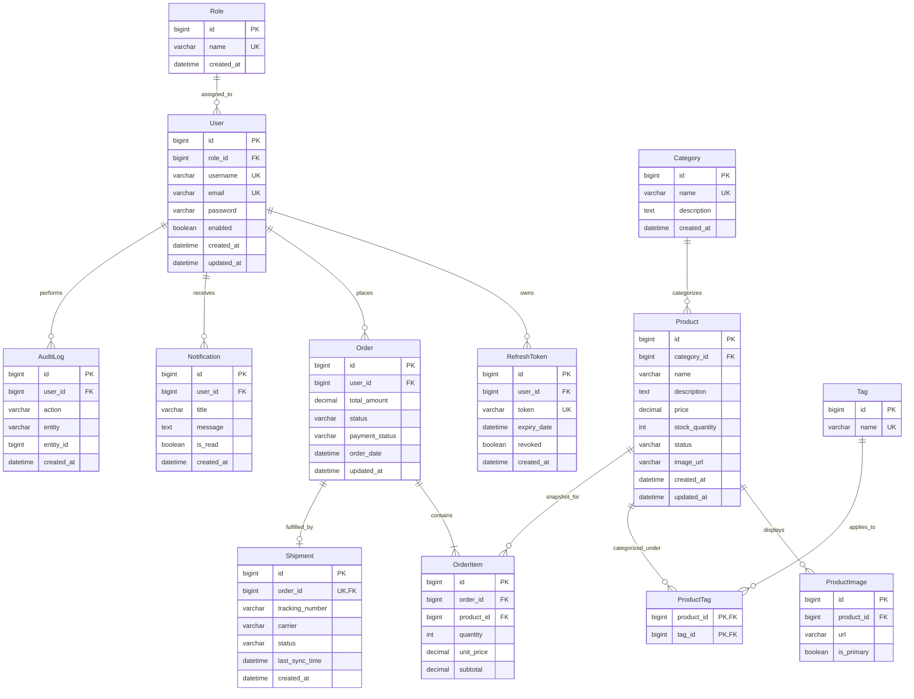

# Đặc tả Cơ sở Dữ liệu & Lược đồ Quan hệ (Database Architecture)

> **Hệ quản trị CSDL**: MySQL 8.0 (InnoDB Engine)  
> **Bộ mã ký tự**: `utf8mb4` | **Collation**: `utf8mb4_unicode_ci`  
> **Công cụ Quản lý Migration**: Flyway  
> **Ngữ cảnh Ứng dụng**: Hệ thống Backend Thương mại Điện tử (Modular Monolith)

---

## 1. Tổng quan & Nguyên tắc Thiết kế CSDL

Cơ sở dữ liệu được chuẩn hóa theo chuẩn 3NF, bảo đảm tính toàn vẹn dữ liệu quan hệ, tuân thủ nguyên tắc ACID và tối ưu hóa hiệu năng truy vấn thông qua hệ thống Index có chủ đích. Toàn bộ lược đồ bảng, ràng buộc khóa và dữ liệu hạt giống (seed data) được quản lý **duy nhất qua các file Flyway Migration**. Nghiêm cấm mọi hành vi chạy câu lệnh DDL thủ công ngoài môi trường hoặc để Hibernate tự động sinh cấu trúc (`ddl-auto: update/create`).

---

## 2. Sơ đồ Quan hệ Thực thể (ERD - Entity Relationship Diagram)

---

## 3. Trách nhiệm Từng Bảng & Cấu trúc Chi tiết (Schema Detail)

### 3.1 Bảng `roles` (Vai trò Người dùng)
Lưu trữ các nhóm quyền hạn truy cập của hệ thống (phục vụ RBAC).
- `id` (BIGINT, PK, AUTO_INCREMENT): Khóa chính định danh vai trò.
- `name` (VARCHAR(50), NOT NULL, UNIQUE): Tên quyền duy nhất (`ROLE_CUSTOMER`, `ROLE_ADMIN`, `ROLE_STAFF`).
- `created_at` (DATETIME, DEFAULT CURRENT_TIMESTAMP): Thời điểm khởi tạo vai trò.

### 3.2 Bảng `users` (Tài khoản Người dùng)
Lưu trữ danh tính khách hàng và nhân viên quản trị.
- `id` (BIGINT, PK, AUTO_INCREMENT): Khóa chính định danh người dùng.
- `role_id` (BIGINT, NOT NULL, FK -> `roles.id` ON DELETE RESTRICT): Vai trò phân quyền của người dùng.
- `username` (VARCHAR(100), NOT NULL, UNIQUE): Tên đăng nhập duy nhất.
- `email` (VARCHAR(255), NOT NULL, UNIQUE): Địa chỉ email đăng nhập duy nhất.
- `password` (VARCHAR(255), NOT NULL): Mật khẩu đã băm bằng thuật toán BCrypt (tuyệt đối không lưu plaintext).
- `enabled` (TINYINT(1), DEFAULT 1): Cờ kích hoạt tài khoản (1: Đang hoạt động, 0: Bị khóa).
- `created_at` (DATETIME, DEFAULT CURRENT_TIMESTAMP): Thời điểm tạo tài khoản.
- `updated_at` (DATETIME, DEFAULT CURRENT_TIMESTAMP ON UPDATE CURRENT_TIMESTAMP): Thời điểm cập nhật hồ sơ gần nhất.

### 3.3 Bảng `refresh_tokens` (Mã Làm mới Phiên Đăng nhập)
Lưu trữ token làm mới phiên đăng nhập JWT, hỗ trợ xoay vòng bảo mật (RTR).
- `id` (BIGINT, PK, AUTO_INCREMENT): Khóa chính định danh token.
- `user_id` (BIGINT, NOT NULL, FK -> `users.id` ON DELETE CASCADE): Người dùng sở hữu token.
- `token` (VARCHAR(500), NOT NULL, UNIQUE): Chuỗi mã token ngẫu nhiên bảo mật dạng UUID.
- `expiry_date` (DATETIME, NOT NULL): Thời hạn hết hiệu lực của token (7 ngày).
- `revoked` (TINYINT(1), DEFAULT 0): Cờ đánh dấu đã bị thu hồi (1: Đã thu hồi / vô hiệu, 0: Hợp lệ).
- `created_at` (DATETIME, DEFAULT CURRENT_TIMESTAMP): Thời điểm phát hành token.

### 3.4 Bảng `categories` (Danh mục Sản phẩm)
Phân loại các nhóm sản phẩm trong sàn thương mại điện tử.
- `id` (BIGINT, PK, AUTO_INCREMENT): Khóa chính định danh danh mục.
- `name` (VARCHAR(100), NOT NULL, UNIQUE): Tên danh mục duy nhất.
- `description` (TEXT, NULL): Mô tả chi tiết về danh mục.
- `created_at` (DATETIME, DEFAULT CURRENT_TIMESTAMP): Thời điểm tạo danh mục.

### 3.5 Bảng `products` (Sản phẩm Bày bán)
Lưu trữ thông tin chi tiết và số lượng tồn kho của từng sản phẩm.
- `id` (BIGINT, PK, AUTO_INCREMENT): Khóa chính định danh sản phẩm.
- `category_id` (BIGINT, NOT NULL, FK -> `categories.id` ON DELETE RESTRICT): Danh mục chứa sản phẩm.
- `name` (VARCHAR(255), NOT NULL): Tên hiển thị của sản phẩm.
- `description` (TEXT, NULL): Bài viết mô tả chi tiết sản phẩm.
- `price` (DECIMAL(12,2), NOT NULL): Giá bán hiện tại của sản phẩm (`price > 0`).
- `stock_quantity` (INT, NOT NULL, DEFAULT 0): Số lượng tồn kho hiện tại (`stock_quantity >= 0`).
- `status` (VARCHAR(30), NOT NULL): Trạng thái sản phẩm (`ACTIVE`, `INACTIVE`, `OUT_OF_STOCK`).
- `image_url` (VARCHAR(500), NULL): Đường dẫn ảnh đại diện chính của sản phẩm.
- `created_at` (DATETIME, DEFAULT CURRENT_TIMESTAMP): Thời điểm tạo sản phẩm.
- `updated_at` (DATETIME, DEFAULT CURRENT_TIMESTAMP ON UPDATE CURRENT_TIMESTAMP): Thời điểm cập nhật giá/tồn kho gần nhất.

### 3.6 Bảng `product_images` (Thư viện Ảnh Sản phẩm)
Lưu trữ danh sách các hình ảnh chi tiết của sản phẩm.
- `id` (BIGINT, PK, AUTO_INCREMENT): Khóa chính ảnh.
- `product_id` (BIGINT, NOT NULL, FK -> `products.id` ON DELETE CASCADE): Sản phẩm sở hữu ảnh.
- `url` (VARCHAR(500), NOT NULL): Đường dẫn CDN/URL của hình ảnh.
- `is_primary` (TINYINT(1), DEFAULT 0): Cờ đánh dấu ảnh chính đại diện (1: Ảnh chính, 0: Ảnh phụ).

### 3.7 Bảng `tags` (Nhãn Gắn Sản phẩm)
Lưu trữ các từ khóa/nhãn hỗ trợ tìm kiếm sản phẩm (ví dụ: "Hot", "Sale", "Mới").
- `id` (BIGINT, PK, AUTO_INCREMENT): Khóa chính tag.
- `name` (VARCHAR(50), NOT NULL, UNIQUE): Tên nhãn duy nhất.

### 3.8 Bảng `product_tags` (Bảng Liên kết Sản phẩm - Tag)
Bảng trung gian thể hiện mối quan hệ Many-to-Many giữa Sản phẩm và Tag.
- `product_id` (BIGINT, NOT NULL, FK -> `products.id` ON DELETE CASCADE).
- `tag_id` (BIGINT, NOT NULL, FK -> `tags.id` ON DELETE CASCADE).
- **PRIMARY KEY** (`product_id`, `tag_id`).

### 3.9 Bảng `orders` (Đơn đặt hàng)
Lưu trữ thông tin tổng quát của giao dịch đặt hàng.
- `id` (BIGINT, PK, AUTO_INCREMENT): Khóa chính đơn hàng.
- `user_id` (BIGINT, NOT NULL, FK -> `users.id` ON DELETE RESTRICT): Khách hàng đặt mua.
- `total_amount` (DECIMAL(12,2), NOT NULL): Tổng số tiền thanh toán của đơn hàng.
- `status` (VARCHAR(50), NOT NULL): Trạng thái vòng đời đơn hàng (`PENDING`, `CONFIRMED`, `PROCESSING`, `SHIPPED`, `COMPLETED`, `CANCELLED`).
- `payment_status` (VARCHAR(50), NOT NULL): Trạng thái thanh toán (`UNPAID`, `PAID`, `FAILED`, `REFUNDED`).
- `order_date` (DATETIME, DEFAULT CURRENT_TIMESTAMP): Thời điểm khách đặt mua đơn hàng.
- `updated_at` (DATETIME, DEFAULT CURRENT_TIMESTAMP ON UPDATE CURRENT_TIMESTAMP): Thời điểm cập nhật tiến độ đơn hàng gần nhất.

### 3.10 Bảng `order_items` (Chi tiết Mục Đơn hàng Snapshot)
Lưu trữ snapshot đóng băng giá và thông tin mục mua tại thời điểm đặt hàng.
- `id` (BIGINT, PK, AUTO_INCREMENT): Khóa chính dòng sản phẩm trong đơn.
- `order_id` (BIGINT, NOT NULL, FK -> `orders.id` ON DELETE CASCADE): Đơn hàng sở hữu.
- `product_id` (BIGINT, NOT NULL, FK -> `products.id` ON DELETE RESTRICT): Sản phẩm được mua.
- `quantity` (INT, NOT NULL): Số lượng mua (`quantity > 0`).
- `unit_price` (DECIMAL(12,2), NOT NULL): Giá bán snapshot đóng băng tại thời điểm đặt hàng.
- `subtotal` (DECIMAL(12,2), NOT NULL): Thành tiền của dòng (`unit_price * quantity`).

### 3.11 Bảng `shipments` (Thông tin Vận chuyển Đơn hàng)
Lưu trữ dữ liệu kết nối hãng giao vận, có quan hệ 1:1 với đơn hàng.
- `id` (BIGINT, PK, AUTO_INCREMENT): Khóa chính vận đơn.
- `order_id` (BIGINT, NOT NULL, UNIQUE, FK -> `orders.id` ON DELETE RESTRICT): Đơn hàng được vận chuyển.
- `tracking_number` (VARCHAR(100), NULL): Mã theo dõi vận đơn từ đối tác vận chuyển.
- `carrier` (VARCHAR(100), NULL): Tên đơn vị vận chuyển (ViettelPost, DHL, GHTK,...).
- `status` (VARCHAR(50), NULL): Trạng thái giao vận (`LABEL_CREATED`, `PICKED_UP`, `IN_TRANSIT`, `DELIVERED`,...).
- `last_sync_time` (DATETIME, NULL): Lần cuối cùng đồng bộ dữ liệu với hệ thống giao vận.
- `created_at` (DATETIME, DEFAULT CURRENT_TIMESTAMP): Thời điểm tạo yêu cầu giao vận.

### 3.12 Bảng `notifications` (Hộp thư Thông báo Người dùng)
Lưu trữ các thông báo đẩy, cập nhật trạng thái đơn hàng gửi đến tài khoản người dùng.
- `id` (BIGINT, PK, AUTO_INCREMENT): Khóa chính thông báo.
- `user_id` (BIGINT, NOT NULL, FK -> `users.id` ON DELETE CASCADE): Người dùng nhận thông báo.
- `title` (VARCHAR(255), NOT NULL): Tiêu đề thông báo.
- `message` (TEXT, NOT NULL): Nội dung chi tiết thông báo.
- `is_read` (TINYINT(1), DEFAULT 0): Trạng thái đã đọc (1: Đã đọc, 0: Chưa đọc).
- `created_at` (DATETIME, DEFAULT CURRENT_TIMESTAMP): Thời điểm phát sinh thông báo.

### 3.13 Bảng `audit_logs` (Nhật ký Kiểm toán Hệ thống)
Lưu trữ các thao tác quản trị và thay đổi trạng thái quan trọng phục vụ tra cứu tuân thủ.
- `id` (BIGINT, PK, AUTO_INCREMENT): Khóa chính nhật ký.
- `user_id` (BIGINT, NULL, FK -> `users.id` ON DELETE SET NULL): Người dùng thực hiện thao tác (NULL nếu do hệ thống tự động).
- `action` (VARCHAR(100), NOT NULL): Hành động được thực hiện (ví dụ: `ORDER_CANCELLED`, `STOCK_ADJUSTED`).
- `entity` (VARCHAR(100), NOT NULL): Tên thực thể bị tác động (`Order`, `Product`,...).
- `entity_id` (BIGINT, NULL): Khóa chính của bản ghi bị tác động.
- `created_at` (DATETIME, DEFAULT CURRENT_TIMESTAMP): Thời điểm ghi nhận hành động.

---

## 4. Ràng buộc Toàn vẹn Khóa ngoại (Referential Integrity Constraints)

1. **Chính sách `ON DELETE RESTRICT` (Ngăn chặn Xóa Dữ liệu Gốc)**:
   - Áp dụng trên các quan hệ cấu trúc cốt lõi: `categories -> products`, `users -> orders`, `products -> order_items`, `roles -> users`.
   - Ngăn chặn triệt để hành vi xóa một danh mục khi vẫn còn sản phẩm đang thuộc danh mục đó, hoặc xóa tài khoản khách hàng khi đã phát sinh đơn hàng lịch sử.
2. **Chính sách `ON DELETE CASCADE` (Xóa Đồng bộ theo Thực thể Cha)**:
   - Chỉ áp dụng đối với các thực thể con phụ thuộc hoàn toàn vào thực thể cha và không có ý nghĩa khi đứng một mình:
     - `products -> product_images`: Xóa sản phẩm thì ảnh của nó tự động bị xóa.
     - `products -> product_tags`: Xóa sản phẩm thì liên kết tag bị xóa.
     - `orders -> order_items`: Xóa đơn hàng thì các item snapshot trong đơn bị xóa.
     - `users -> refresh_tokens`: Xóa người dùng thì toàn bộ phiên token liên quan bị xóa.
     - `users -> notifications`: Xóa người dùng thì hộp thư thông báo bị xóa.

---

## 5. Chiến lược Đánh Chỉ mục (Indexing Strategy)

Các chỉ mục Index đã được tạo lập trực tiếp trong cơ sở dữ liệu MySQL nhằm tối ưu thời gian phản hồi:

| Tên Bảng | Tên Index | Cột Được Index | Loại Index | Mục đích Tối ưu Truy vấn |
|---|---|---|---|---|
| `users` | `idx_users_email` | `email` | B-TREE (UNIQUE) | Tăng tốc độ xác thực khi người dùng đăng nhập bằng email |
| `users` | `fk_users_roles` | `role_id` | B-TREE | Tăng tốc độ truy vấn phân quyền theo vai trò |
| `refresh_tokens` | `idx_refresh_token_user`| `user_id` | B-TREE | Truy vấn danh sách token của người dùng khi thu hồi hoặc đăng xuất |
| `products` | `idx_products_name` | `name` | B-TREE | Tìm kiếm sản phẩm theo tên |
| `products` | `idx_products_category` | `category_id` | B-TREE | Lọc danh sách sản phẩm theo danh mục |
| `products` | `idx_products_status` | `status` | B-TREE | Lọc nhanh các sản phẩm đang bày bán (`ACTIVE`) |
| `product_images` | `idx_product_images_product` | `product_id` | B-TREE | Lấy danh sách ảnh khi xem chi tiết sản phẩm |
| `orders` | `idx_orders_user` | `user_id` | B-TREE | Xem lịch sử đơn hàng của khách hàng theo tài khoản |
| `orders` | `idx_orders_status` | `status` | B-TREE | Hỗ trợ admin lọc đơn hàng theo trạng thái xử lý |
| `order_items` | `idx_order_items_order` | `order_id` | B-TREE | Lấy toàn bộ mục hàng trong một đơn hàng |
| `order_items` | `fk_order_items_product` | `product_id` | B-TREE | Thống kê số lượng đơn hàng chứa một sản phẩm |
| `shipments` | `order_id` | `order_id` | UNIQUE | Tra cứu thông tin vận đơn 1:1 từ mã đơn hàng |
| `notifications` | `idx_notifications_user` | `user_id` | B-TREE | Tải danh sách thông báo trong hộp thư người dùng |
| `audit_logs` | `fk_audit_user` | `user_id` | B-TREE | Tra cứu lịch sử thao tác theo người dùng |

---

## 6. Chính sách Xóa mềm (Soft Delete) & Kiểm toán (Auditing)

### Quy định Xóa mềm (Soft Delete)
- **Tuyệt đối không xóa vật lý (`DELETE FROM`)** các bản ghi tài chính và lịch sử giao dịch (`orders`, `order_items`).
- Đối với `products` và `categories`, ưu tiên sử dụng cờ trạng thái (`status = 'INACTIVE'` hoặc `is_deleted = true`) để bảo toàn tính toàn vẹn khóa ngoại khi có các đơn hàng cũ đang tham chiếu.

### Cột Kiểm toán Tự động (Auditing Columns)
- `created_at`: Ghi nhận thời điểm tạo mới bản ghi bằng `@CreatedDate` trong Spring Data JPA.
- `updated_at`: Ghi nhận thời điểm cập nhật bản ghi gần nhất bằng `@LastModifiedDate` và thuộc tính `ON UPDATE CURRENT_TIMESTAMP` tại tầng MySQL.

---

## 7. Quy tắc Quản lý Migration với Flyway

1. **Vị trí Lưu trữ**: Mọi file migration đặt tại `src/main/resources/db/migration/`.
2. **Quy ước Đặt tên File**:  
   `V{PhiênBản}__{TênMôTảBằngSnakeCase}.sql` (sử dụng đúng 2 dấu gạch dưới `__`).
   - Ví dụ: `V1__init_schema.sql`, `V2__seed_default_roles.sql`.
3. **Quy tắc Bất biến**:
   - Khi một file migration đã được áp dụng (checksum đã ghi vào bảng `flyway_schema_history`), **tuyệt đối không sửa đổi nội dung file đó**.
   - Mọi chỉnh sửa cấu trúc bảng hoặc thêm cột phải tạo file migration mới với phiên bản tăng dần tiếp theo (ví dụ: `V3__add_discount_price_to_products.sql`).
   - Tất cả câu lệnh `CREATE TABLE` trong file migration phải chỉ định rõ `ENGINE=InnoDB DEFAULT CHARSET=utf8mb4 COLLATE=utf8mb4_unicode_ci`.

---

## 8. Đặc tả Tầng Repository Layer & Chiến lược Truy vấn (Repository Layer Specification)

Tầng Repository là lớp duy nhất trong hệ thống được phép tương tác trực tiếp với cơ sở dữ liệu MySQL thông qua Spring Data JPA và Hibernate. Toàn bộ Repository được tổ chức theo Feature-based Package Structure dưới từng module tương ứng.

### 8.1 Bảng Ánh xạ Thực thể và Repository (Entity - Repository Mapping)

| Module | Thực thể (Entity) | Repository Interface | Package | Khóa chính |
|---|---|---|---|---|
| `user` | `User` | `UserRepository` | `com.ecommerce.user.repository` | `Long` |
| `user` | `Role` | `RoleRepository` | `com.ecommerce.user.repository` | `Long` |
| `auth` | `RefreshToken` | `RefreshTokenRepository` | `com.ecommerce.auth.repository` | `Long` |
| `product` | `Category` | `CategoryRepository` | `com.ecommerce.product.repository` | `Long` |
| `product` | `Product` | `ProductRepository` | `com.ecommerce.product.repository` | `Long` |
| `product` | `ProductImage` | `ProductImageRepository` | `com.ecommerce.product.repository` | `Long` |
| `product` | `Tag` | `TagRepository` | `com.ecommerce.product.repository` | `Long` |
| `order` | `Order` | `OrderRepository` | `com.ecommerce.order.repository` | `Long` |
| `order` | `OrderItem` | `OrderItemRepository` | `com.ecommerce.order.repository` | `Long` |
| `notification` | `Notification` | `NotificationRepository` | `com.ecommerce.notification.repository` | `Long` |
| `shipping` | `Shipment` | `ShipmentRepository` | `com.ecommerce.shipping.repository` | `Long` |

### 8.2 Các Truy vấn Then chốt theo Từng Repository

#### 1. `UserRepository`
- `findByUsername(String username)`: Tìm người dùng theo tên đăng nhập.
- `findByEmail(String email)`: Tìm người dùng theo địa chỉ email.
- `existsByUsername(String username)` / `existsByEmail(String email)`: Kiểm tra trùng lặp khi đăng ký.
- `findByUsernameWithRole(String username)`: Truy vấn người dùng nạp kèm vai trò (`JOIN FETCH u.role`) để phục vụ xác thực bảo mật Spring Security trong 1 query duy nhất.
- `findWithRoleByEmail(String email)`: Truy vấn người dùng nạp kèm Role sử dụng `@EntityGraph(attributePaths = {"role"})`.
- `findByEnabled(Boolean enabled, Pageable pageable)`: Lấy danh sách người dùng theo trạng thái kích hoạt có phân trang.

#### 2. `RoleRepository`
- `findByName(String name)`: Tìm vai trò theo tên mã định danh (ví dụ: `ROLE_CUSTOMER`, `ROLE_ADMIN`).
- `existsByName(String name)`: Kiểm tra sự tồn tại của vai trò.

#### 3. `RefreshTokenRepository`
- `findByToken(String token)`: Tìm token trong database.
- `findValidToken(String token)`: Tìm token hợp lệ chưa thu hồi, chưa hết hạn và nạp kèm thông tin User (`JOIN FETCH rt.user`).
- `findByUserId(Long userId)`: Lấy danh sách token của người dùng.
- `revokeAllUserTokens(Long userId)`: Đánh dấu thu hồi (`revoked = true`) toàn bộ token của người dùng bằng `@Modifying` query.
- `deleteExpiredTokens(LocalDateTime now)`: Xóa các token đã quá hạn khỏi database để dọn dẹp dung lượng.

#### 4. `CategoryRepository`
- `findByName(String name)`: Tìm danh mục theo tên chính xác.
- `existsByName(String name)`: Kiểm tra trùng tên danh mục khi tạo mới.
- `findByNameContainingIgnoreCase(String name)`: Tìm kiếm danh mục theo từ khóa.

#### 5. `ProductRepository`
- `findByCategoryId(Long categoryId, Pageable pageable)`: Danh sách sản phẩm theo danh mục có phân trang.
- `findByStatus(ProductStatus status, Pageable pageable)`: Danh sách sản phẩm theo trạng thái kinh doanh.
- `findByNameContainingIgnoreCase(String name, Pageable pageable)`: Tìm kiếm nhanh theo tên sản phẩm có phân trang.
- `findByIdWithDetails(Long id)`: Truy vấn chi tiết sản phẩm nạp trọn vẹn Category, danh sách Images và danh sách Tags bằng `@EntityGraph(attributePaths = {"category", "images", "tags"})`.
- `searchAndFilterProducts(...)`: Lọc và tìm kiếm đa tiêu chí (keyword, categoryId, status, khoảng giá minPrice-maxPrice) kết hợp `JOIN FETCH p.category` và `countQuery` riêng biệt có phân trang.
- `findStockQuantityById(Long id)`: Lấy riêng số lượng tồn kho của sản phẩm, tối ưu hiệu năng không cần nạp toàn bộ thực thể.

#### 6. `ProductImageRepository`
- `findByProductId(Long productId)`: Lấy danh sách hình ảnh của sản phẩm.
- `findByProductIdOrderByIsPrimaryDesc(Long productId)`: Lấy ảnh sắp xếp ưu tiên ảnh chính lên đầu.
- `findByProductIdAndIsPrimaryTrue(Long productId)`: Tìm ảnh chính duy nhất của sản phẩm.
- `deleteByProductId(Long productId)`: Xóa nhanh toàn bộ ảnh của sản phẩm bằng `@Modifying` query.

#### 7. `TagRepository`
- `findByName(String name)`: Tìm thẻ theo tên.
- `findByNameIn(Collection<String> names)`: Tìm danh sách thẻ theo danh sách tên.
- `findByProductId(Long productId)`: Lấy các thẻ được gán cho một sản phẩm.

#### 8. `OrderRepository`
- `findByUserId(Long userId, Pageable pageable)`: Lấy lịch sử đơn hàng của người dùng có phân trang.
- `findByStatus(OrderStatus status, Pageable pageable)`: Lấy đơn hàng theo trạng thái xử lý.
- `findByUserIdWithUser(Long userId, Pageable pageable)`: Lấy đơn hàng của người dùng nạp kèm User (`JOIN FETCH o.user`) có phân trang.
- `findAllWithUserByStatus(OrderStatus status, Pageable pageable)`: Danh sách đơn hàng nạp kèm User dành cho quản trị viên.
- `findByIdWithDetails(Long orderId)`: Truy vấn chi tiết đơn hàng nạp trọn vẹn User, danh sách OrderItems và Product của từng item (`JOIN FETCH o.user LEFT JOIN FETCH o.orderItems oi LEFT JOIN FETCH oi.product`).
- `existsByIdAndUserId(Long id, Long userId)`: Xác thực quyền sở hữu đơn hàng của khách hàng (Data Ownership Authorization).
- `countByStatus(OrderStatus status)` / `countByUserIdAndStatus(Long userId, OrderStatus status)`: Đếm số lượng đơn hàng phục vụ dashboard thống kê.

#### 9. `OrderItemRepository`
- `findByOrderId(Long orderId)`: Lấy danh sách các mặt hàng trong đơn hàng.
- `findByOrderIdWithProduct(Long orderId)`: Lấy danh sách mặt hàng nạp kèm thông tin Product (`JOIN FETCH oi.product`).
- `existsByProductId(Long productId)`: Kiểm tra tính toàn vẹn nghiệp vụ, ngăn chặn xóa sản phẩm đã từng phát sinh đơn hàng.
- `deleteByOrderId(Long orderId)`: Xóa các mặt hàng của đơn hàng.

#### 10. `NotificationRepository`
- `findByUserIdOrderByCreatedAtDesc(Long userId, Pageable pageable)`: Lấy danh sách thông báo của người dùng sắp xếp mới nhất.
- `findByUserIdAndIsReadOrderByCreatedAtDesc(...)`: Lấy thông báo theo trạng thái đã đọc/chưa đọc.
- `countByUserIdAndIsReadFalse(Long userId)`: Đếm số lượng thông báo chưa đọc hiển thị badge icon trên UI.
- `markAllAsReadByUserId(Long userId)`: Đánh dấu tất cả thông báo là đã đọc bằng câu lệnh UPDATE hàng loạt `@Modifying`.
- `markAsReadByIdAndUserId(Long id, Long userId)`: Đánh dấu đã đọc một thông báo có kiểm tra quyền sở hữu.

#### 11. `ShipmentRepository`
- `findByOrderId(Long orderId)`: Tra cứu đơn vận chuyển từ mã đơn hàng.
- `findByTrackingNumber(String trackingNumber)`: Tra cứu theo mã vận đơn của đơn vị giao hàng.
- `findByIdWithOrderAndUser(Long id)` / `findByOrderIdWithOrderAndUser(Long orderId)`: Truy vấn vận chuyển nạp kèm Order và User (`JOIN FETCH s.order o JOIN FETCH o.user`).

---

### 8.3 Cơ chế Phân trang & Sắp xếp (Pagination & Sorting)

- Toàn bộ các API truy vấn danh sách bản ghi đều chấp nhận tham số `Pageable` (`org.springframework.data.domain.Pageable`) và trả về `Page<T>` (`org.springframework.data.domain.Page`).
- Tham số phân trang mặc định: `page` (bắt đầu từ 0), `size` (mặc định 10 hoặc 20, giới hạn tối đa 100), `sort` (thuộc tính sắp xếp, ví dụ: `sort=createdAt,desc`).
- Đối với các câu truy vấn `@Query` có `JOIN FETCH` trên quan hệ To-One (ví dụ `JOIN FETCH p.category` hoặc `JOIN FETCH o.user`), **bắt buộc phải khai báo thuộc tính `countQuery` riêng biệt** không chứa FETCH JOIN. Lý do: JPA không cho phép dùng FETCH JOIN trong câu lệnh đếm tổng số dòng `COUNT(...)`, việc tách rõ ràng giúp Spring Data JPA sinh câu lệnh phân trang chính xác tuyệt đối.

### 8.4 Kỹ thuật Tìm kiếm & Lọc Dữ liệu (Search & Filtering)

1. **Derived Query Methods**: Áp dụng cho các truy vấn điều kiện đơn giản, rõ ràng (`findByEmail`, `existsByName`, `findByCategoryId`).
2. **JPQL Queries với Dynamic Parameters**:
   - Áp dụng kỹ thuật truyền tham số linh hoạt với mệnh đề `(:param IS NULL OR field = :param)`.
   - Giúp một phương thức Repository duy nhất có thể xử lý linh hoạt mọi tổ hợp lọc do người dùng chọn trên giao diện mà không cần ghép chuỗi SQL thủ công.
3. **JPA Specification & `JpaSpecificationExecutor<T>`**:
   - Được kế thừa sẵn tại `ProductRepository` nhằm sẵn sàng mở rộng các bộ lọc động phức tạp có nhiều tiêu chí tùy biến nâng cao trong tương lai.

### 8.5 Chiến lược Giải quyết Triệt để Bài toán N+1 Query

Lỗi N+1 Query xảy ra khi truy vấn nạp 1 thực thể cha nhưng sau đó Hibernate phải thực thi thêm N truy vấn phụ để nạp các thực thể liên quan qua quan hệ `FetchType.LAZY`. Hệ thống giải quyết triệt để vấn đề này bằng các kỹ thuật:

1. **Sử dụng `JOIN FETCH` cho quan hệ To-One**:
   - An toàn tuyệt đối với cơ chế phân trang (Pagination).
   - Ví dụ: `SELECT p FROM Product p JOIN FETCH p.category c` giúp lấy sản phẩm và danh mục chỉ trong 1 truy vấn SQL duy nhất.
2. **Sử dụng `@EntityGraph` cho quan hệ Collection (To-Many)**:
   - Sử dụng cho truy vấn chi tiết một thực thể duy nhất (`findByIdWithDetails`), ví dụ: nạp cùng lúc Category, Images và Tags của một sản phẩm.
   - `@EntityGraph(attributePaths = {"category", "images", "tags"})` thông báo cho Hibernate thực hiện LEFT OUTER JOIN nạp toàn bộ cấu trúc đồ thị thực thể trong 1 truy vấn.
3. **Sử dụng `SELECT DISTINCT` khi JOIN FETCH với Collection**:
   - Khi thực hiện `JOIN FETCH o.orderItems oi`, câu lệnh SQL sinh ra có thể nhân số dòng order tương ứng với số item con. Sử dụng `SELECT DISTINCT o` tại tầng JPQL đảm bảo Hibernate lọc trùng lặp và trả về danh sách đối tượng duy nhất.
4. **Tránh `FetchType.EAGER` trong Entity**:
   - 100% quan hệ `@ManyToOne`, `@OneToMany`, `@ManyToMany`, `@OneToOne` trong toàn bộ hệ thống đều được cấu hình tường minh là `FetchType.LAZY`. Tầng Service/Repository sẽ chủ động quyết định khi nào cần nạp dữ liệu liên kết thông qua các method tối ưu hóa nêu trên.

